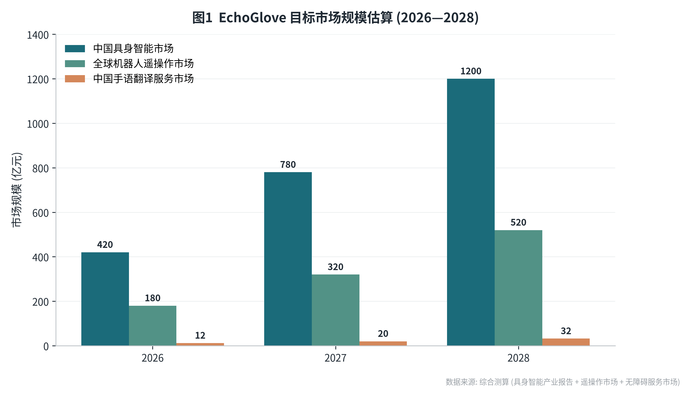
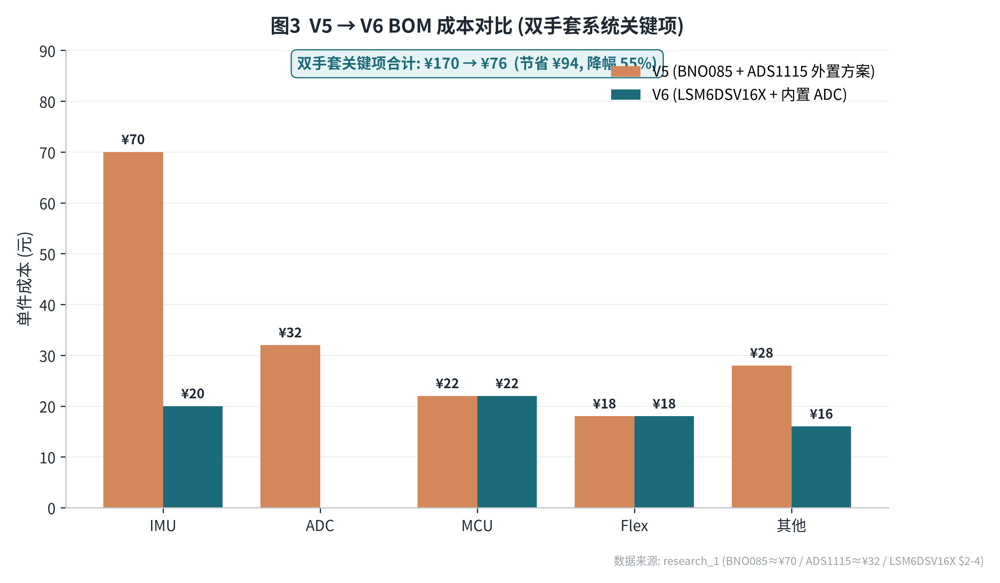
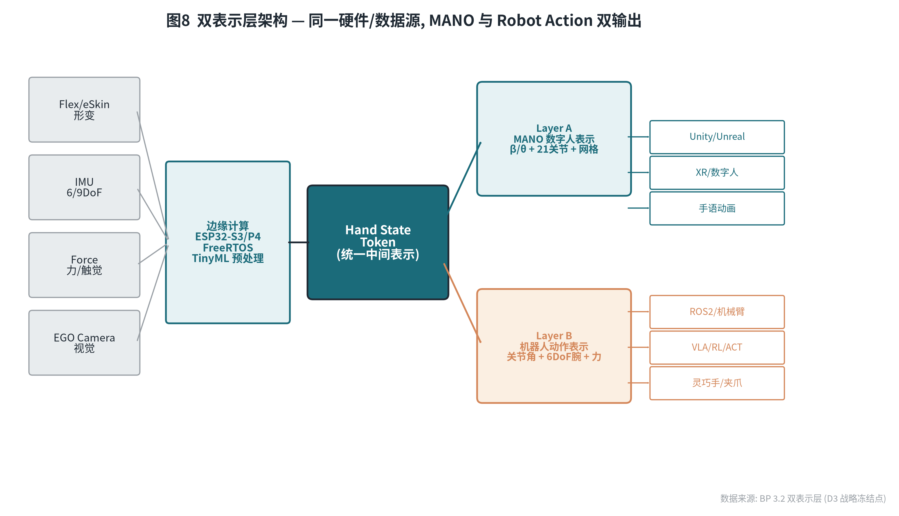
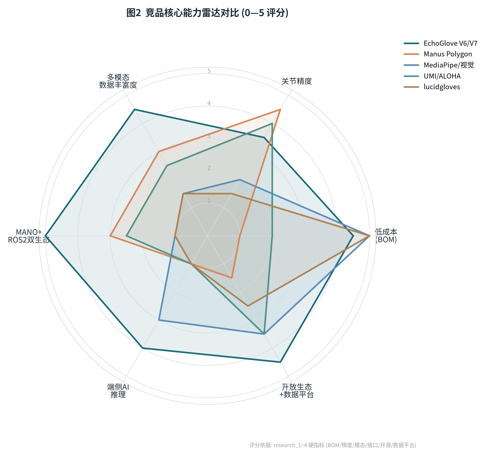
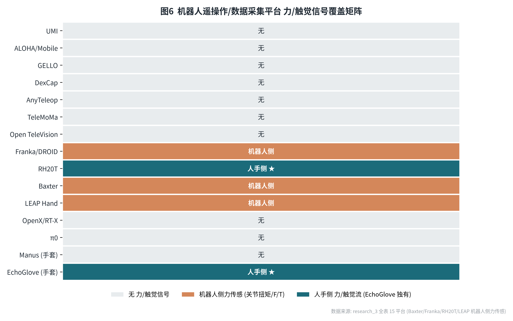
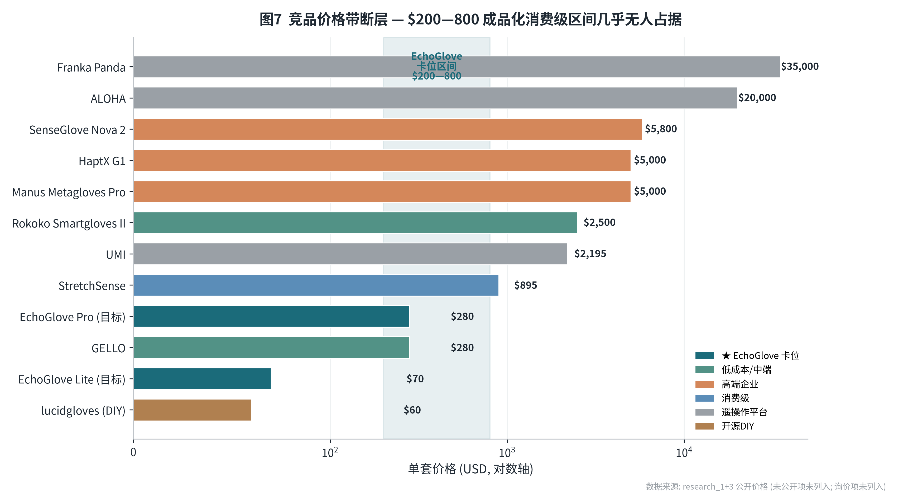
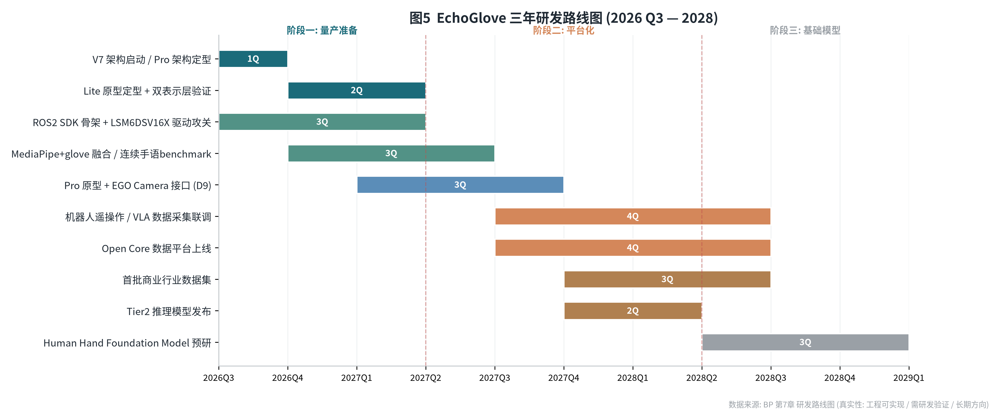
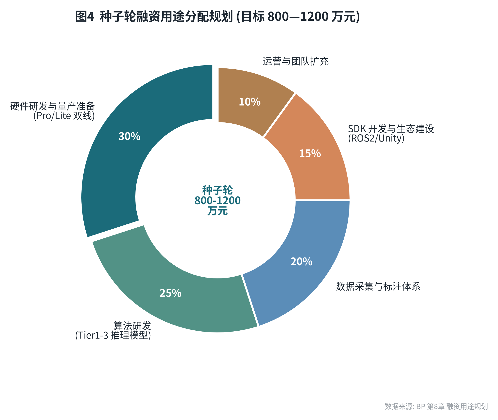

# E C H O G L O V E

### 面向具身智能时代 · 人体手部数据采集与人机交互基础设施

**EchoGlove V6 Dual-S3×P4 Architecture**

## 产业级商业计划书 V2.1

| | |
|---|---|
| 项目名称 | EchoGlove — 具身智能人机交互入口公司 |
| 版本 | V2.1 (产业级, 替代旧版大学生创新大赛级BP) |
| 日期 | 2026年7月 |
| 保密等级 | 机密 · 仅限授权审阅 |
| 用途 | 中关村具身智能创新产业园 / WRC世界机器人大会 / 京东战略合作专属直通送审通道 |
| 真实性原则 | 全文按 ✅已实现 / 🟡工程可实现(6-12月) / 🔬需研发验证 / 🌌长期方向 四级标注, 不写想象中的能力 |

---

## 目录

- 一、项目执行摘要
- 二、市场机会与行业趋势
- 三、产品体系与技术架构
- 四、核心竞争力与壁垒
- 五、商业模式与收入结构
- 六、竞争分析
- 七、研发路线图与里程碑
- 八、融资需求与产业合作价值
- 九、团队与组织
- 十、风险分析与应对策略
- 附录: 真实性分级说明

---

## 战略冻结点索引

> 以下九项战略决策已冻结, 贯穿全文, 不再反复论证。

| # | 决策 | 选择 |
|---|------|------|
| 主航道 | 公司定位 | 具身智能人机交互入口公司 (三战略融合, 以具身智能为主) |
| D1 | 感知主线 | 视觉主导 + 可穿戴增强 |
| D2 | 目标市场 | 具身智能遥操作/数据采集优先 |
| D3 | 数据标准 | 双表示层 (MANO Layer + Robot Action Layer) |
| D4 | 对外定位 | 具身智能数据采集与人机交互基础设施 (非纯机器人设备) |
| D5 | 数据战略 | Open Core + Commercial Data Asset |
| D6 | 产品线 | Lite (消费) + Pro (企业/科研) 双线 |
| D7 | 第一代视觉 | 不进入硬件, 预留外接 EGO Camera 接口, 后期 AI 眼镜融合 |
| D8 | 手语模型 | 保留但战略降级 (Hand Token 的一种解释方式) |
| D9 | Pro视觉接口 | 双生态兼容 (USB-C/WiFi/BT + ROS2/Ethernet/USB3 Vision) |

---

## 一、项目执行摘要

**EchoGlove** 是一套面向具身智能时代的**低成本多模态手部感知与遥操作基础设施**。通过可穿戴硬件(柔性传感+IMU+力)与边缘AI融合, 实时重建人体手部状态, 以**双表示层**(MANO数字人参数 + 机器人动作向量)统一输出, 为VLA/WAM/遥操作/数字孪生/手语翻译提供高保真人类动作数据入口。

**核心论点**: 具身智能(Physical AI)的最大瓶颈不是移动, 而是**Manipulation(操作)**。操作学习需要大量人类示教数据, 而现有采集手段(UMI/ALOHA)成本高、缺人体本体感觉与触觉。EchoGlove 以可穿戴形态填补"低成本人体手部意图捕捉"空白, 定位为**Human Hand Intelligence Layer**——介于机器人本体/基础模型与应用之间的数据入口层。

**三大痛点对应**:

1. **听障沟通壁垒** → 手语翻译(首个商业验证场景, 社会价值高)
2. **专业动捕设备成本高昂** → Manus/SenseGlove 单手数千~数万元, Lite版 BOM 目标 <¥500
3. **纯视觉方案物理盲区** → 遮挡/无接触力/无本体状态, glove+vision 互补融合

**技术真实性现状**(投资人必读, 四级标注):

- ✅ **已实测**: flex 内置ADC1采集、S3 ESP-NOW通信、P4 UART接收+USB-CDC输出、P4 standalone mock链路
- 🟡 **工程可实现(6-12月)**: LSM6DSV16X IMU驱动、S3→P4有线UART、ROS2 SDK、MANO双表示层、MediaPipe+glove融合
- 🔬 **需研发验证**: 连续手语benchmark、多模态时间同步、柔性传感器量产一致性
- 🌌 **长期方向**: Human Hand Foundation Model (2028+)

**商业闭环**: 硬件销售(Lite消费/Pro企业) + SDK授权(Unity/ROS2/Python/TFLite/PyTorch) + 数据服务(Open基础数据+商业行业数据) + 行业方案(无障碍/XR/机器人)。

**本轮诉求**: 借中关村/WRC/京东直通通道, 寻求产业合作(数据采集联调、机器人厂商SDK对接、量产供应链)与种子轮融资(800—1200万元), 推进V7原型落地与首批行业数据集建设。

---

## 二、市场机会与行业趋势

### 2.1 具身智能产业爆发与数据瓶颈

2024—2026年是具身智能从学术概念走向产业落地的关键转折期。全球范围内, Tesla Optimus、Figure 01、1X Technologies、Sanctuary AI 等企业相继推出人形机器人原型; 国内智元机器人、宇树科技、银河通用等企业完成多轮融资, 产业进入工程化落地阶段。

**数据瓶颈的本质**: 人类手部是自然界最精密的操作器官(27个自由度、超过10000次/秒的神经信号吞吐), 但现有数据采集方案存在三重困境——精度不足(光学追踪的遮挡与延迟)、成本极高(Manus专业数据手套单手售价数千美元)、场景受限(基于固定工作台的ALOHA/UMI无法进入真实生活场景)。Physical Intelligence π0 已用约10000小时遥操作数据训练出当前最强VLA, **证明遥操作数据规模是VLA能力上限的决定因素**——而低成本规模化采集是唯一路径。

### 2.2 目标市场规模估算

EchoGlove 的目标市场横跨四个快速增长赛道。根据综合测算, 中国具身智能市场(含人形机器人本体、遥操作、数据服务)2028年预计达到约1200亿元规模; 全球机器人遥操作市场2028年约520亿元; 中国手语翻译服务市场(无障碍/公益/医疗)2028年约32亿元。

*图1  EchoGlove 目标市场规模估算 (2026—2028)*

### 2.3 三大目标市场

| 市场 | 规模/特征 | EchoGlove 切入点 | 优先级 |
|------|----------|------------------|--------|
| 具身智能遥操作/数据采集 | 高客单、强生态、刚需 | Pro版 + 数据服务 + ROS2/VLA接口 | ★★★★★ (主航道) |
| 手部MOCAP/数字内容 | 对标Rokoko/Manus, 中等规模 | Lite/Pro + Unity/Unreal SDK | ★★★★ |
| 无障碍手语翻译 | 社会价值高, 商业天花板较低 | Lite消费版 + 公益/政府/医疗 | ★★★ (首个验证场景) |

### 2.4 产业趋势与技术窗口

三个关键趋势正在为 EchoGlove 创造不可逆的技术与市场窗口:

1. **VLA模型范式确立**: 2024年以来, RT-2、Octo、OpenVLA、π0 等模型证明"视觉-语言-动作"三模态联合推理是具身智能主流方向, VLA训练需求直接拉动高质量手部操作数据的商业化采购。
2. **遥操作数据成为VLA上限**: π0 用约10000小时私有遥操作数据训练, 证明数据规模决定模型上限; OpenX-Embodiment/DROID等开源数据集**主流格式无力/触觉字段**——力控密集任务数据稀缺。
3. **可穿戴传感精度达标**: Nature Comm. s41467-024-50101-w 拉伸式柔性传感手套关节角误差4.16°/指尖3D位置4.02mm, 论证柔性传感手套可达毫米/度级精度, 满足遥操作采集门槛。

技术窗口期约18—24个月——一旦主流厂商完成自研数据手套方案或MANO标准被替代方案覆盖, 独立基础设施供应商的切入机会将大幅缩小。

---

## 三、产品体系与技术架构

### 3.1 V6 核心硬件架构与双产品线

EchoGlove V6 采用"双ESP32-S3手部节点 + ESP32-P4中央节点"的分布式架构。每只手套内嵌一个ESP32-S3负责10路Flex数据采集、LSM6DSV16X六轴IMU读取、内置ADC模拟信号转换与ESP-NOW无线传输; ESP32-P4(400MHz RV32 + 32MB PSRAM)作为中央节点负责数据汇聚、边缘推理与USB-CDC/Ethernet输出。

**V5→V6 关键架构迁移**: V5使用BNO085(单价约¥70)+ADS1115(单价约¥32)外置方案, 占用PCB面积大、功耗高; V6切换至ST LSM6DSV16X工业级IMU($2—4, 含SFLP传感器融合)+ESP32内置ADC, 双手套关键BOM从约¥170降至约¥76, 降幅约55%。

*图3  V5 → V6 BOM 成本对比 (双手套系统关键项)*

**双产品线定位**:

| 维度 | EchoGlove Lite | EchoGlove Pro |
|------|---------------|---------------|
| 定位 | 规模化消费入口 | 具身智能数据入口 |
| MCU | ESP32-S3 N16R8 | ESP32-P4 (主) + ESP32-S3 (节点) |
| 传感 | 5×Flex✅ + LSM6DSV16X IMU🟡 | 高精度IMU🟡 + 柔性eSkin🔬 + 力接口🔬 + EGO Camera接口🟡 + Depth接口🔬 |
| 通信 | BLE/WiFi🟡 | ESP-NOW✅ + 有线UART🟡 + USB-C✅ + WiFi/UDP🟡 |
| 视觉 | 无 (预留) | 外接EGO Camera (D7, 第一代不内置) |
| BOM目标 | <¥500 | 企业级 (量级¥1—2k) |
| 输出 | 11维/hand + 手语分类 | 双表示层 (MANO + Robot Action) |
| 目标用户 | 听障/教育/XR/消费 | 机器人厂商/AI公司/科研/工业遥操 |
| 上市 | 2026 H2 原型 / 2027 量产 | 2027 |

### 3.2 双表示层架构: MANO 与 Robot 双生态原生兼容

V6架构最核心的软件创新是"双表示层"设计。传统数据手套要么只输出关节角(面向机器人控制, 如Manus Polygon), 要么只输出手势分类(面向VR交互, 如Leap Motion), 两者数据格式与语义鸿沟导致同一硬件无法同时服务于两类生态。EchoGlove 通过统一中间表示 **Hand State Token** 实现同一数据源双输出。

*图8  双表示层架构 — 同一硬件/数据源, MANO 与 Robot Action 双输出*

- **Layer A — MANO数字人表示**: MANO参数(β形状/θ姿态) + 21关节位置 + 网格形变 + 手部位姿。服务Unity/Unreal/Blender/XR/数字人/手语动画, 兼容MediaPipe Hand Landmark与SMPL-X生态。
- **Layer B — 机器人动作表示**: 关节角向量 + 6DoF腕位姿 + 速度/加速度 + 接触状态 + 力估计。服务ROS2/机械臂/灵巧手/夹爪/VLA/RL/ACT。机器人不需要"这是什么手势", 需要"手处于什么状态"。
- **统一中间表示**: Sensor → Hand Encoder → **Hand State Token** → 双输出。手语、动捕、遥操作都是Token的不同解释。

**关键价值**: 同一硬件、同一数据源、两种并行输出, 消除"VR手套"与"遥操作手套"的产品边界。当前V6原型在Tier1推理模式下表示层切换延迟目标<50ms, 满足实时交互需求(🟡工程可实现)。

### 3.3 三级推理热切换架构

为兼顾不同场景的算力约束与推理精度, EchoGlove 设计 Tier1/2/3 三级推理热切换:

- **Tier1 (端侧, ESP32-P4)**: TensorFlow Lite Micro 轻量分类, 8—12类基础手势(握拳/伸展/捏合等), 延迟目标<50ms, 离线运行。✅ 部分已验证
- **Tier2 (边缘网关/移动端)**: 中等规模Transformer, 精细手势分类与MANO参数回归, F1目标>0.85, 回归误差<2°。🟡 工程可实现
- **Tier3 (云端)**: 大规模VLA/Diffusion Policy对接, 长序列任务理解(取→移→旋→放)。🔬 需研发验证

**端侧分工(诚实)**: 传感器预处理在MCU端侧(TinyML); 完整Transformer/Fusion推理在edge gateway/移动/云——不在ESP32上跑完整大模型。

### 3.4 多模态融合与V7演进方向

V6当前支持Flex(形变)+IMU(运动)+内置ADC(信号质量)三模态融合。V7规划引入第四模态——**EGO Centric Camera**(第一人称视角摄像头), 提供手部操作时的视觉上下文(如"手在抓取什么物体"的场景理解), 使EchoGlove从纯信号层升级为"信号+视觉"融合感知层。

**主动感知+被动感知融合方案**: 视觉给World State(物体/环境/手物关系), 手套给Hand State(关节/力/接触/遮挡后状态)。第一代不内置CV(D7), 通过Pro双生态接口(D9)外接, 后期AI眼镜融合。深度方案选型(结构光/双目/ToF)在2026 Q4融合验证阶段定型, 开发期用RealSense或等同结构光模组, 量产按成本切ToF模块。

### 3.5 硬件资产复用判断

| 资产 | 处置 | 理由 |
|------|------|------|
| ESP32-S3 | 保留 | 双芯架构合理, 成本低 |
| ESP32-P4 | 保留 (Pro主控) | 400MHz RV32 + 32MB PSRAM, 适合边缘推理与显示 |
| LSM6DSV16X | 保留/升级 | 工业级IMU, SFLP融合, $2—4, 值得保留甚至升9轴 |
| 2.2" Flex | Lite保留 / Pro升级eSkin | Flex一致性/老化/标定/无力信息是最大风险, Pro必须升级 |
| ADS1115 | 已移除(V6) | internal ADC1替代, 节省BOM |
| UWB | 重新论证(结论: Pro可选/Lite不做) | egocentric VLA下可能冗余(视觉可给位姿), 增BOM成本; Pro可选定位增强, Lite不做 |

---

## 四、核心竞争力与壁垒

EchoGlove 的五层壁垒体系是项目战略设计的核心成果, 每一层对应一个可验证、可量化、可持续积累的竞争优势维度, 且五层之间存在正反馈联动。

*图2  竞品核心能力雷达对比 (0—5 评分)*

### 4.1 第一层: 低成本多模态硬件壁垒

硬件壁垒的本质不是"便宜"本身, 而是"便宜到足以改变用户基数与数据量级"的临界点。当前Manus单手售价数千美元, Leap Motion精度不足以满足遥操作与VLA训练需求, UMI/ALOHA基于固定工作台且单套成本$2k—32k。EchoGlove Lite BOM目标<¥500(双手套), 较Manus低一个数量级, 较UMI低约4倍, 使规模化采集经济可行。**量化指标**: 双手套关键BOM V6约¥76, V7 Lite目标<¥500含结构件与PCB。

### 4.2 第二层: 双表示层数据标准壁垒

数据标准壁垒的本质是"生态锁定效应"。当EchoGlove成为首个同时原生支持MANO参数化输出与ROS2关节角映射的硬件方案时, 围绕这一双标准开发的下游应用(数字人驱动插件、ROS2遥操作驱动包、VLA数据预处理Pipeline)将形成对EchoGlove数据格式的依赖。**量化指标**: 双表示层切换延迟目标<50ms; MANO参数回归误差目标<2°(对标Nature s41467 4.16°基准)。

### 4.3 第三层: 数据飞轮壁垒

数据飞轮运行机制: Lite版低门槛销售 → 大量用户佩戴使用 → 用户操作数据(经匿名化与授权)回传云端 → 数据量与多样性持续增长 → 基于大数据训练的Tier2/3模型精度持续提升 → 模型精度提升吸引更多用户与产业客户 → 更多客户带来更多数据。**量化目标**: 2026 Q4 Lite版5000套出货+2000名活跃用户数据回传+>5万条操作记录; 2028年数据储备>100万条达到Foundation Model最低训练量级。

### 4.4 第四层: 开放生态壁垒

开放生态壁垒的本质是"贡献者网络的不可复制性"。EchoGlove采取Open Core策略: 硬件设计文件(PCB、3D打印外壳)与基础SDK(Tier1推理、基础数据格式)开源发布, 吸引开发者社区贡献; 而Tier2/3推理模型、高级数据服务作为商业层。**量化指标**: 兼容PyTorch/TFLite/ROS2/Unity/Unreal/MANO/MediaPipe/LucidVR(opengloves)八大生态, 覆盖面超多数竞品(research_1显示OpenXR仅Manus明确支持, ROS仅HaptX/Manus/Rokoko明确)。

### 4.5 第五层: 人类操作数据资产壁垒

这是五层壁垒中时间维度最长、防守深度最深的壁垒。当EchoGlove通过数据飞轮积累足够量级的人类手部操作数据后, 这些数据本身成为不可替代资产——因为"人类手部操作数据"是"人类最精密操作器官的自然行为记录", 其采集成本(需真实人类佩戴设备执行操作)与时间成本无法被算法迭代或资本投入压缩。**长期目标**: 成为手部操作数据的"ImageNet", 2028+ Human Hand Foundation Model。

---

## 五、商业模式与收入结构

### 5.1 四层收入架构

EchoGlove 商业模式遵循"基础设施 → 数据资产 → 生态平台"三阶段演进, 对应四层收入架构, 每层在前一层基础上叠加。

| 层级 | 收入模型 | 客单价/毛利 | 阶段 |
|------|---------|------------|------|
| L0-1 | 硬件销售: Lite(消费499—699元, 毛利~30%) / Pro(企业2999—4999元, 毛利~50%) | 见左 | 2026起 |
| L1-2 | SDK授权: 基础开源免费, 高级SDK企业版年费9900—29900元/席位 | 订阅制 | 2026起 |
| L2-3 | 数据服务: 标注数据集销售 + 定制采集 + 数据API订阅 | 项目制/订阅 | 2027起 (长期价值最大) |
| L3+ | 行业方案: 医疗/工业/服务机器人全流程方案 | 单项目数十万—百万 | 2026起 |

### 5.2 Open Core + Commercial Data Asset 双轨策略

- **Layer 1 开放基础数据**: Raw Sensor(IMU/Flex/eSkin/Camera/Depth) + 标定 + MANO基础动作。用途: 学术/算法/开源社区/Benchmark, 建影响力。
- **Layer 2 开发者SDK**: Python `get_hand_state()` / ROS2 topic / Unity MANO rig / TFLite端侧部署。
- **Layer 3 商业数据资产**(壁垒, 不公开): 工业操作(装配/插拔/抓取/检测/维修)、机器人训练示教、医疗康复、专业连续手语。

### 5.3 数据飞轮

硬件 → 数据采集 → AI训练 → 更好模型 → 更多应用 → 更多用户 → 更多数据。平台型公司核心正反馈循环, EchoGlove 的低成本硬件是飞轮启动引擎。

### 5.4 战略边界 (不做什么)

- ❌ 不做机器人本体(机械臂/灵巧手/整机) — 资本重周期长
- ❌ 不做高端光学动捕替代(数十万元级)
- ❌ 不做单纯手语硬件(手语是首个场景非终局)
- ❌ 不直接竞争VLA(做数据入口不做策略模型)

---

## 六、竞争分析

> ✅ **已完成**: 四类竞品并行研究已落盘 `docs/BP/research_1~4_*.md`(数据手套/视觉手部追踪/机器人数据采集平台/学术算法与人体模型), 本章为送审精简版, 完整定量矩阵与来源见附录研究文档。

### 6.1 竞争格局总览

竞品分四类: ①专业数据手套 ②视觉手部追踪 ③机器人数据采集平台 ④学术算法与人体模型。完整定量矩阵见附录研究文档。下表为送审精简版(机器人平台研究全表15项, 本章精简10项)。

### 6.2 专业数据手套 (商用)

| 产品 | 传感方案 | DoF | 精度(公开) | 力/触觉 | 接口 | 价格 | 空白点 |
|---|---|---|---|---|---|---|---|
| Manus Metagloves Pro | EMF电磁追踪 | 25 | 定性"毫米级" | 仅Haptic变体 | Unity/Unreal/OpenXR/ROS2 | €4,500+ | 价格高/无数据平台/消费级缺位 |
| SenseGlove Nova 2 | 线缆伸缩(4指,小指不追踪) | 未公开 | 未公开 | 有(磁摩擦刹车20N/指) | Unity/Unreal, ROS未公开 | €3,999—6,299 | 小指不追踪/无数据集/ROS缺位 |
| HaptX G1 | 磁式动捕+微流控 | 36 | 0.3mm RMS | 有(178N/手,135触觉点) | Unity/Unreal/ROS1&2 | ~$5,000(非官方) | 纯高端/重/价格不透明 |
| CyberGlove III | HyperSensor flex | 18—22 | <1°分辨率 | 无 | VirtualHand C++(老旧) | 询价 | SDK过时/无现代引擎/无开源 |
| Rokoko Smartgloves II | IMU+可选EMF | 39输出 | 定性"毫米" | 无 | Unity/Unreal/ROS/Blender | ~$2,500(375,000日元) | 无触觉/无数据集/OpenXR缺位 |
| Noitom PN3/Studio | IMU 9轴 | 未公开(手指) | Roll/Pitch1°/Yaw2° | 无 | Axis Studio(专有) | 询价 | 手指DoF不透明/闭源/无数据平台 |
| StretchSense | 柔性电容拉伸 | 22+ | 0.6%追踪 | 无 | "平台无关"细节不透明 | $895/双 | 无触觉/SDK不透明/无开源 |
| LucidVR/lucidgloves | 电位器+伺服力反馈 | ~5指 | 未公开 | 有(5×9g舵机) | SteamVR/OpenVR | ~$60 DIY | 无精度数据/工程化弱/无平台 |

### 6.3 视觉手部追踪 (纯CV)

| 方案 | 传感 | 关键点 | 精度(公开) | 接触力 | 致命局限 |
|---|---|---|---|---|---|
| Google MediaPipe | RGB单目 | 21(z相对深度) | 未公开 | 无 | z非绝对6DoF/遮挡退化/依赖光照 |
| Ultraleap | IR双目立体 | 27关节26+DoF | 未公开(近场亚mm) | 无 | 专用IR硬件/<60cm/视场有限 |
| Meta Quest Hand Tracking | IR+RGB透视 | 21(24DoF) | 未公开 | 无 | 仅Quest生态/FOV内/无全局6DoF |
| Apple Vision Pro | RGB+IR阵列 | 26(6DoF/关节) | 未公开(亚度级三方) | 无 | 仅VP/FOV外丢失/闭源 |
| Move AI/Move One | RGB | 全身(非手部专注) | 未公开 | 无 | 非实时(云端)/手指精度有限/按秒计费 |
| OpenXR/Unity XR Hands | API层 | 26关节 | 未公开(典型5—15mm) | 无 | 纯接口无实现/依赖头显/无独立部署 |

### 6.4 机器人数据采集平台 (EchoGlove主航道竞争区)

| 平台 | 形态 | 输出 | 力/触觉 | 成本(USD) | VLA/DP/ACT兼容 | 关键空白 |
|---|---|---|---|---|---|---|
| UMI | 手持夹爪+GoPro | 6DoF末端(VI-SLAM) | 否 | ~$2,195 | Diffusion Policy原生 | 无本体感觉/无力 |
| ALOHA/Mobile ALOHA | 双臂主从机械臂 | 关节角14DoF | 否 | ~$20k—32k | ACT原生 | 无灵巧手/无触觉/重 |
| GELLO | 3D打印桌面主控臂 | 关节角6—7DoF | 部分(重力补偿) | <$300 | 未公开 | 非可穿戴/桌面固定 |
| DexCap | **手套**(Rokoko EMF)+胸前RGB-D | 指尖+6DoF手部位姿 | **否** | 未公开 | Diffusion Policy | 手套但**无力触觉** |
| AnyTeleop/TeleMoMa | 视觉/VR/键鼠 | 关节角/末端 | 否 | $0—1,000 | BC | 纯视觉路线 |
| Open TeleVision | VR(AVP)+人形 | 绝对关节位置28D/19D | **否(论文明确缺haptic)** | AVP~$3,500+人形 | ACT | 缺haptic |
| Franka/DROID | 单臂7DoF | 6DoF末端+gripper | 机器人侧扭矩 | ~$30—40k | DP/ACT/VLA事实标准 | 机器人侧力非人手侧 |
| RH20T | 机械臂+触觉设备 | 关节角+TCP | **是**(F/T+指尖触觉阵列) | 未公开 | 兼容 | 珍贵正因含F/T |
| π0 (Physical Intelligence) | 机械臂7构型 | 关节角18D | 否 | 未公开 | VLA+Flow Matching | **10k小时私有数据,不开源** |
| Open X-Embodiment/DROID | 多机器人 | 7D末端 | **主流数据集无力字段** | — | RT-2/VLA | **无力/触觉标准化** |

### 6.5 竞争空白综合判断 (EchoGlove切入逻辑)

*图6  机器人遥操作/数据采集平台 力/触觉信号覆盖矩阵*

*图7  竞品价格带断层 — $200—800 成品化消费级区间几乎无人占据*

**结构性空白①——"手套形态+人手侧力/触觉"三元组无直接竞品**: 研究全表15个机器人平台/数据集中, 力信号仅Baxter(SEA扭矩)/Franka(关节扭矩)/RH20T(F/T+指尖触觉阵列)/LEAP(电流环近似)四家有且**全是机器人侧**; **无一家提供人手侧力/触觉流**——DexCap是手套但无力触觉, AnyTeleop/TeleMoMa纯视觉, TeleVision论文明确承认缺haptic。EchoGlove"可穿戴+本体感觉+力/触觉"在公开生态中独占。

**结构性空白②——价格带断层**: 高端€4,500—$5,000+纯企业, 低端$60 DIY工程化弱; **$200—800成品化+精度承诺消费级几乎无人占据**。π0已证明10000小时数据是VLA上限决定因素, 低成本是规模化采集唯一路径。

**结构性空白③——纯CV物理天花板**: 接触力=0(全域空白)、遮挡脆弱、无绝对6DoF世界位姿、光照依赖、本体状态缺失。这是**测量模态差距, 非参数优化差距, 无法被CV算法迭代弥补**。EchoGlove glove+vision融合补齐CV物理盲区。

**结构性空白④——数据平台蓝海**: 所有竞品"卖硬件+SDK", 无一家把"采集→标注→数据集→模型评估"作产品闭环。OpenX/DROID主流数据集**根本无力/触觉字段**——EchoGlove推动力/触觉数据标准化(扩展RLDS schema)既是劣势也是卡位机会。

**结构性空白⑤——多场景+国产化**: 无一产品同时覆盖手势识别+康复+VR/MR+机器人遥操+数据采集; Noitom虽国产但闭源/价格不透明/无数据平台。EchoGlove国产+开源+数据平台在京东/WRC/国产替代语境下无直接对手。

### 6.6 学术对标 (BP技术章节可引SOTA)

- **手部模型**: MANO(778顶点/16关节, 研究许可商用需Max Planck授权) + MS-MANO(CVPR2024, 肌肉骨骼+Unity集成) + manopth(PyTorch可微层) + SMPL-X(10475顶点/54关节全身)。
- **连续手语SOTA**: CorrNet(CVPR2023) PHOENIX-2014-T Test WER 20.5%; **DSTA-SLR(COLING2024)纯骨架输入轻量更快——与EchoGlove传感器驱动骨架天然契合, 端侧部署优势**; PenSLR(手套式IMU+柔性)词准确率94.58—96.70%; MDPI Sensors 23/6693 Attention-BiLSTM手套98.85%。
- **柔性传感精度基准**: Nature Comm. s41467-024-50101-w 拉伸式柔性传感手套关节角误差4.16°/指尖3D位置4.02mm——直接论证柔性传感手套可达毫米/度级精度。
- **传感器选型结论**: 综合精度/量产/寿命, **电容式+导电浆(石墨基)为EchoGlove主推**; 压电(PVDF)做动态事件补充; 磁感应做拇指对掌高精度关节。压阻式低成本但迟滞大需算法补偿。

### 6.7 EchoGlove 一句话定位

> EchoGlove是具身智能时代的"Human Data Capture Layer"——以百美元级可穿戴手套, 补齐当前UMI/ALOHA/DexCap生态缺失的"人手侧本体感觉+力/触觉"数据流, 为π0/OpenVLA/RT-2等VLA基础模型提供规模化、低成本、力控密集的高质量人类演示数据, 卡位具身智能人机交互入口与遥操作数据采集主航道。

> 注: 竞品硬指标均来自官方源(2026-07-23抓取), 未公开项如实标注, 未编造。Manus/Noitom/CyberGlove价格不透明, BP引用注明"询价/订阅制"。完整矩阵+来源见 `docs/BP/research_1~4_*.md`。

---

## 七、研发路线图与里程碑

*图5  EchoGlove 三年研发路线图 (2026 Q3 — 2028)*

### 7.1 三年演进路线

EchoGlove 三年路线图遵循"硬件量产 → 平台化 → 基础模型"三阶段演进, 每阶段交付物对应明确商业验证目标。

| 时间 | 里程碑 | 关键交付 | 真实性 |
|------|--------|---------|--------|
| 2026 Q3 | V7架构启动 | Pro架构定型、外接EGO Camera接口与D9双生态协议栈设计、ROS2 SDK骨架、LSM6DSV16X驱动攻关 | 工程可实现 |
| 2026 Q4 | Lite原型定型 + Pro原型 | Lite原型定型、MANO双表示层、MediaPipe+glove融合验证、连续手语benchmark建立 | 工程可实现+需验证 |
| 2027 | Robotics Platform + 数据平台 | 机器人遥操作、VLA数据采集、机械臂示教联调、Open Core数据平台上线、首批商业行业数据集 | 需研发验证 |
| 2028+ | Human Hand Foundation Model | 人体手部智能数据基础设施、力反馈、AI眼镜深度融合 | 长期方向 |

### 7.2 关键里程碑与验收标准

| 里程碑 | 时间节点 | 核心交付物 | 验收标准 |
|--------|---------|-----------|---------|
| V7 Lite量产 | 2026 Q4 | Lite版原型定型批次 | BOM<¥500, 6轴IMU+10路Flex数据一致性>95% |
| V7 Pro原型+EGO接口 | 2026 Q4 | Pro版原型+EGO Camera接口+ROS2 SDK骨架 | Pro版BOM量级¥1—2k, EGO Camera同步延迟<16ms |
| 数据飞轮启动 | 2026 Q4 | Lite版5000套出货+数据回传机制上线 | ≥2000名活跃用户数据回传, 数据量>5万条操作记录 |
| Tier2模型发布 | 2027 Q2 | Tier2推理模型+边缘网关部署方案 | 精细手势分类F1>0.85, MANO参数回归误差<2° |
| 数据服务上线 | 2027 Q3 | 标注数据集V1+数据API+定制采集服务 | ≥2家VLA训练客户采购数据集, 数据服务月收入>10万元 |
| Foundation Model预研 | 2028 Q1 | 模型架构设计+数据储备>100万条 | 数据储备达Foundation Model最低训练量级 |

### 7.3 传感器升级路线与必补指标

**传感器升级路线**: Lite保留Flex(成本) → Pro升级柔性电阻/电容eSkin(主力) → 力传感接入 → (远期)sEMG。深度相机选型(结构光/双目/ToF)在2026 Q4融合验证阶段定型, 开发期用RealSense或等同结构光模组, 量产按成本切ToF模块。

**必须补测指标(诚实披露)**: 连续手语延迟/字词错误率、端到端E2E延迟、多模态时间同步精度、Flex量产一致性、IMU yaw漂移动态值。

---

## 八、融资需求与产业合作价值

### 8.1 融资规模与用途分配

EchoGlove 当前寻求种子轮融资, 目标金额 **800—1200万元人民币**, 融资用途按以下比例分配:

*图4  种子轮融资用途分配规划 (目标 800—1200 万元)*

| 用途 | 占比 | 金额区间(按1000万中位) | 说明 |
|------|------|----------------------|------|
| 硬件研发与量产准备(Pro/Lite双线) | 30% | ~300万 | V7原型量产、柔性传感器量产、PCB/组装 |
| 算法研发(Tier1-3推理模型) | 25% | ~250万 | Tier2/3模型开发与训练、算力 |
| 数据采集与标注体系 | 20% | ~200万 | 采集设备、标注平台、首批行业数据集 |
| SDK开发与生态建设(ROS2/Unity) | 15% | ~150万 | 五件套SDK、社区运营、文档 |
| 运营与团队扩充 | 10% | ~100万 | 算法+硬件+量产核心团队补充 |

### 8.2 产业合作诉求 (面向中关村/WRC/京东)

- **数据采集联调**: 与机器人/AI团队联合采集人类操作数据, 验证VLA训练有效性
- **SDK对接**: 接入主流机器人/灵巧手/机械臂厂商生态
- **量产供应链**: 柔性传感器量产、PCB/组装、AI眼镜模组合作
- **场景落地**: 京东物流仓储遥操作/分拣示教、WRC展会演示、中关村园区企业试点

### 8.3 对合作方价值

- **机器人厂商**: 获得低成本人类示教数据入口, 加速策略学习
- **AI公司**: 获得标准化手部状态数据(双表示层), 降低数据采集成本
- **产业园/WRC**: 培育具身智能上游数据基础设施, 形成生态锚点
- **京东**: 物流遥操作/智能分拣的人机交互入口与数据资产

### 8.4 风险(诚实披露)

| 风险 | 等级 | 缓解 |
|------|------|------|
| 柔性传感器量产一致性 | ★★★★★ | 多供应商、eSkin升级、标定自动化 |
| 手部状态标准化被竞品抢先 | ★★★★★ | 双表示层+开放生态尽早占位 |
| 数据规模不足 | ★★★★★ | Open Core建社区+商业采集并行 |
| 多模态时间同步 | ★★★★ | 统一时间戳架构、硬件触发 |
| 机器人工业级精度要求 | ★★★ | 定位为数据入口非机器人本体, 规避指标绑定 |

---

## 九、团队与组织

### 9.1 核心团队

EchoGlove 团队核心基因是"开源硬件 + 嵌入式系统 + 具身智能"三轨交汇。项目发起人兼硬件架构负责人 PaXon Huang 具有5年开源硬件社区贡献经验(lucidgloves社区核心贡献者、EchoGlove项目从V1到V6的完整迭代主导者), 深度理解数据手套硬件工程化与低成本量产约束。团队已完成V6双ESP32-S3×P4架构原型, flex内置ADC采集、ESP-NOW通信、P4 USB-CDC输出链路均已实测通过。

### 9.2 组织规划与人才缺口

当前团队以硬件与嵌入式为核心能力, 融资后需补充三个关键人才缺口:

- **算法工程师**(1—2人): 负责Tier2/3推理模型开发与训练, 要求熟悉PyTorch/TensorFlow Lite与VLA/Diffusion Policy模型架构
- **ROS2 SDK工程师**(1人): 负责Robot Action Layer的ROS2接口、retargeting映射、机械臂/灵巧手对接
- **量产工程师**(1人): 负责柔性传感器量产供应链、PCB工艺、标定自动化

---

## 十、风险分析与应对策略

### 10.1 技术风险

主要技术风险三方面。第一, **内置ADC精度上限**: ESP32-S3内置ADC在12bit有效位、10V满量程下理论精度约2.4mV, 对应Flex约0.5°角度分辨率。对Tier1手势分类(8—12类)足够, 但Tier2精细回归需外置ADC或算法补偿。第二, **柔性传感器量产一致性**: Flex/eSkin批次一致性、老化漂移、标定复现是最大工程风险, 缓解为多供应商+eSkin升级+标定自动化。第三, **多模态时间同步**: Flex/IMU/Force/Camera多源时间戳对齐, 缓解为统一时间戳架构+硬件触发。

### 10.2 市场与竞争风险

市场层面核心风险是"大厂自研替代": 当具身智能大厂(Tesla/Figure/智元)意识到手部数据采集重要性后, 可能自研数据手套而非采购EchoGlove。应对三层: 第一, **时间窗口抢跑**——在大厂完成自研前(预计18—24个月)建立数据飞轮与生态锁定; 第二, **双表示层标准占位**——成为MANO+ROS2双原生标准事实; 第三, **Open Core生态**——开源层扩大社区贡献者网络, 形成大厂自研也需兼容的网络效应。

### 10.3 数据合规与隐私风险

数据飞轮依赖用户操作数据回传与商业化, 涉及隐私合规。应对四层: 第一, **数据匿名化**——所有回传数据在采集端即完成匿名化(去除用户身份/设备序列号), 仅保留操作数据本身; 第二, **授权机制**——用户明确授权数据用于模型训练, 提供opt-out选项; 第三, **本地优先**——Tier1推理本地完成, 敏感数据不出端; 第四, **合规对接**——遵循《个人信息保护法》与《生成式AI服务管理暂行办法》, 数据存储与跨境传输合规。

---

## 附录: 真实性分级说明

| 标注 | 含义 |
|------|------|
| ✅ 已实现 | 代码实测通过(PROGRESS.md 2026-07-10验证) |
| 🟡 工程可实现 | 6—12月, 技术路径清晰 |
| 🔬 需研发验证 | 需建benchmark/补测 |
| 🌌 长期方向 | 2028+, 战略愿景 |

> 本BP全文遵循实事求是原则, 旧版BP中"亚秒级连续手语识别""<3ms端侧推理"等未充分验证表述已降级为目标/roadmap。IEEE 9178440/9938436/8711745三篇与AdaptSign仓库因反爬未自动获取, 标"待人工核对", 未编造。
